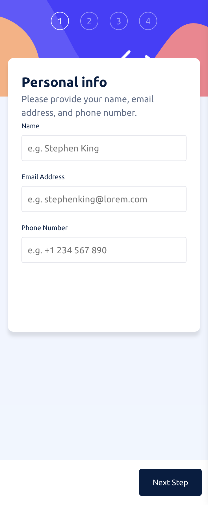
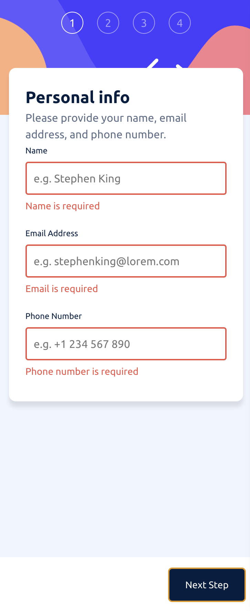

# Frontend Mentor - Multi-step form solution

This is a solution to the [Multi-step form challenge on Frontend Mentor](https://www.frontendmentor.io/challenges/multistep-form-YVAnSdqQBJ). Frontend Mentor challenges help you improve your coding skills by building realistic projects.

## Table of contents

- [Overview](#overview)
  - [The challenge](#the-challenge)
  - [Screenshot](#screenshot)
  - [Links](#links)
- [My process](#my-process)
  - [Built with](#built-with)
  - [What I learned](#what-i-learned)
  - [Continued development](#continued-development)
  - [Useful resources](#useful-resources)
- [Author](#author)
- [Acknowledgments](#acknowledgments)

## Overview

### The challenge

Users should be able to:

- Complete each step of the sequence.
- Go back to a previous step to update their selections.
- See a summary of their selections on the final step and confirm their order.
- View the optimal layout for the interface depending on their device's screen size.
- See hover and focus states for all interactive elements on the page.
- Receive form validation messages if:
- The fields have been missed.
- The email address is not formatted correctly.

Additional features:

- Uncompleted steps are faded, and completed steps are highlighted.
- The previous step is shown as completed when the user moves to the next step.
- Users cannot move to the next step unless required fields are filled or options are selected.
- A "Back Home" button is included on the confirmation step to return to the home page.
- The "Go Back" button on all pages has an orange hover effect, matching the design file.

### Screenshots

  

    
    
Personal Info View

  

  

    
    
Confirmation Screenshot

  

