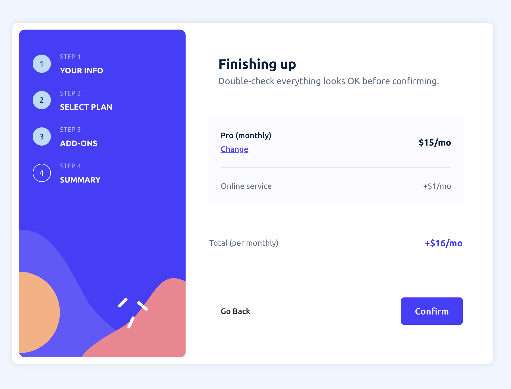

# Frontend Mentor - Multi-step form solution

This is a solution to the [Multi-step form challenge on Frontend Mentor](https://www.frontendmentor.io/challenges/multistep-form-YVAnSdqQBJ). Frontend Mentor challenges help you improve your coding skills by building realistic projects.

## Table of contents

- [Frontend Mentor - Multi-step form solution](#frontend-mentor---multi-step-form-solution)
  - [Table of contents](#table-of-contents)
  - [Overview](#overview)
    - [The challenge](#the-challenge)
    - [Screenshots](#screenshots)
      - [Mobile view screenshots](#mobile-view-screenshots)
      - [Desktop View Screenshots](#desktop-view-screenshots)
    - [Links](#links)
  - [My process](#my-process)
    - [Built with](#built-with)
    - [What I learned](#what-i-learned)
    - [Continued Development](#continued-development)
    - [Useful Resources](#useful-resources)
  - [Author](#author)

## Overview

### The challenge

Users should be able to:

- Complete each step of the sequence.
- Go back to a previous step to update their selections.
- See a summary of their selections on the final step and confirm their order.
- View the optimal layout for the interface depending on their device's screen size.
- See hover and focus states for all interactive elements on the page.
- Receive form validation messages if:
- The fields have been missed.
- The email address is not formatted correctly.

Additional features:

- Uncompleted steps are faded, and completed steps are highlighted.
- The previous step is shown as completed when the user moves to the next step.
- Users cannot move to the next step unless required fields are filled or options are selected.
- A "Back Home" button is included on the confirmation step to return to the home page.
- The "Go Back" button on all pages has an orange hover effect, matching the design file.

### Screenshots

#### Mobile view screenshots

<table>
  <tr>
    <td>
      <strong>Personal Info View:</strong> 
       
      <em>Screenshot of the Personal Info View on mobile.</em>
    </td>
    <td>
      <strong>Personal Info View with Error:</strong> 
       
      <em>Screenshot of the Personal Info View on mobile, including the error messages.</em>
    </td>
  </tr>
</table>

#### Desktop View Screenshots

<table>
  <tr>
    <td>
      <strong>Personal Info View:</strong> 
       
    </td>
    <td>
      <strong>Select Plan View:</strong> 
       
      <em>Screenshot of the Select Plan step with the previous step completed and hover effect on the Go Back button.</em>
    </td>
    <td>
      <strong>Add-Ons View:</strong> 
       
      <em>Screenshot of the Add-Ons step with a selected add-on and hover effect on another add-on.</em>
    </td>
  </tr>
  <tr>
    <td>
      <strong>Summary View:</strong> 
       
      <em>Screenshot of the Summary step with hover effect on the Change option.</em>
    </td>
    <td>
      <strong>Confirmation View:</strong> 
       
      <em>Screenshot of the Confirmation step on desktop.</em>
    </td>
    <td>
      <strong>Confirmation with Hover Effect:</strong> 
       
      <em>Screenshot of the Confirmation step with hover effect on the Back to Home button.</em>
    </td>
  </tr>
</table>

### Links

- Solution URL: [solution URL here]()
- Live Site URL: [live site URL here]()

## My process

### Built with

- HTML5: Used to structure the content in a clear and accessible way.
- CSS Custom Properties: Employed to maintain consistent styling and make it easy to update.
- Flexbox: Utilized to create flexible and responsive layouts.
- Mobile-First Design: Applied to ensure the design works well on mobile devices first, then scales up.
- React: Used to build reusable components and manage the application's state.
- BEM (Block Element Modifier) Naming: Adopted for clear and maintainable CSS class naming.
- React Router: Implemented for seamless navigation between different steps of the form.

### What I learned

- React Router: I learned how to use React Router to manage navigation between different steps of the form. This allowed me to create a seamless multi-step experience without reloading the page, enhancing the user experience and making the application more dynamic.

### Continued Development

- Accessibility Enhancements: Implement additional accessibility features, such as improved keyboard navigation, ARIA roles, and more comprehensive screen reader support.
- Component Optimization: Refactor some of the existing components to make them more reusable and modular, enhancing maintainability and scalability.
- State Management: Explore more advanced state management techniques, potentially integrating a solution like Redux or Context API to manage the app's state more efficiently.
- Animations: Add subtle animations to improve user interactions and provide a smoother experience.

### Useful Resources

- [React Documentation](https://reactjs.org/docs/getting-started.html): The official React documentation was an essential guide for understanding the core concepts of React, such as components, props, and state. It helped me structure the individual steps of the form as reusable components, enhancing code readability and maintainability.

- [React Router Documentation](https://reactrouter.com/web/guides/quick-start): This resource was critical for setting up navigation between the different steps of the form. It taught me how to implement `react-router-dom` to manage multi-page routes.

- [React Hooks Guide (useState & useEffect)](https://reactjs.org/docs/hooks-overview.html): Learning about hooks like `useState` and `useEffect` from this guide helped me manage state between different components, especially when tracking user input across multiple steps. The ability to handle dynamic state updates was crucial for the interactive nature of the form.

- [Handling Forms in React](https://reactjs.org/docs/forms.html): This guide on handling forms in React helped me understand how to manage form inputs, validation, and submission in a structured way. It was particularly useful for implementing form validation and ensuring proper handling of user data.

## Author

- Frontend Mentor - [@Doileo](https://www.frontendmentor.io/profile/Doileo)
- LinkedIn - [@Doina](https://www.linkedin.com/in/doinaleovchindeveloper/)
- GitHub - [@Doileo](https://github.com/Doileo)
